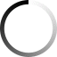

# ModalWeather
Modal with API openweathermap

1) For use you can get a API key after registration  on https://openweathermap.org/
2) Connect jquery.js
3) Open WeatherWidjet.js and find getAPI then change on your API key 

HTML
``
<input type="button" class='open' value="W" >

        
        <input type="button" value='X' class='close'>
        
<input type="button" value='3 DAY FORECAST' class='day3Open'>

        

        

        

        

``

``
            this.getAPID = function () {
            return this.APID = 'YOU API ID';
            }
``

4)  initialize the script: ``weather.init();``

PavelP
